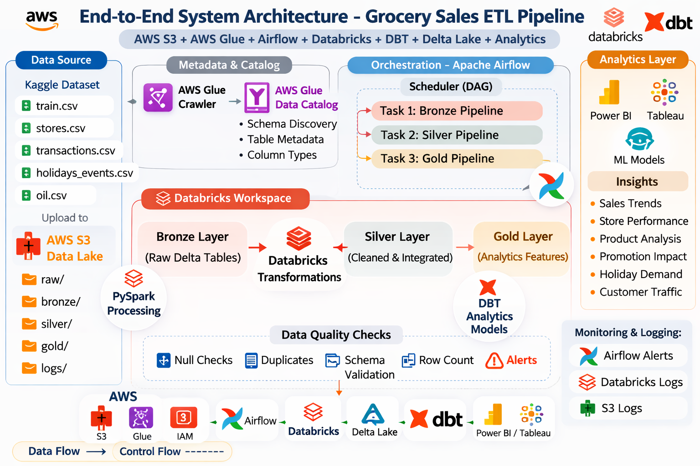
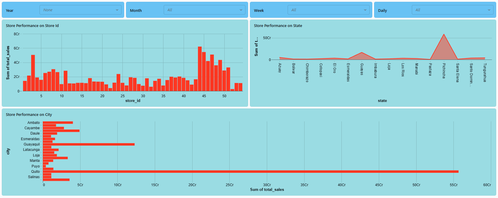
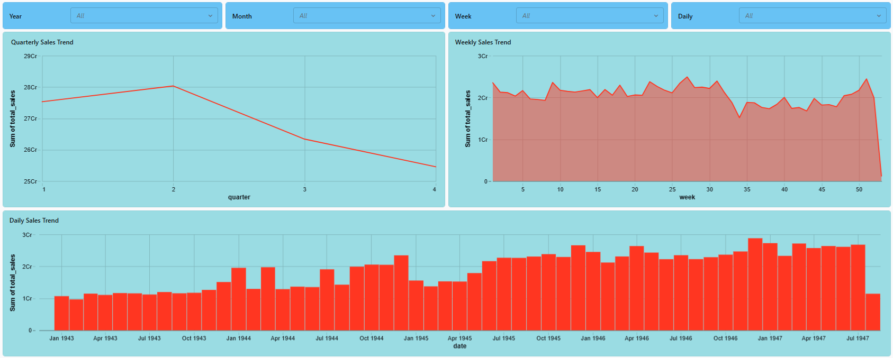
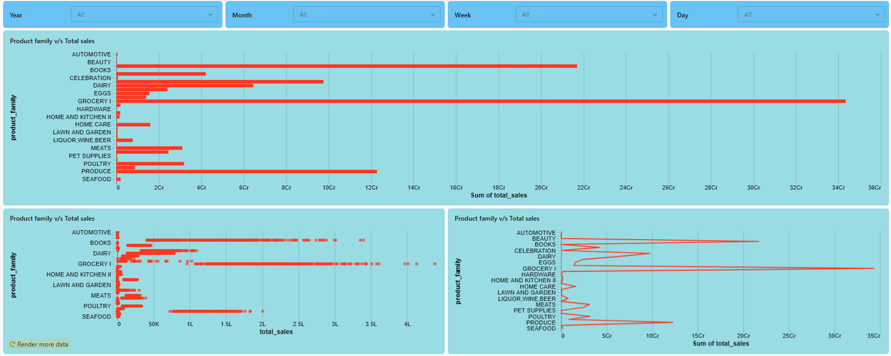
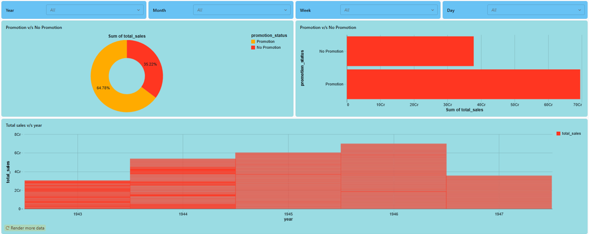
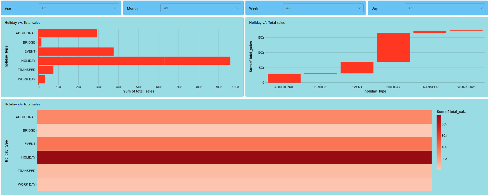
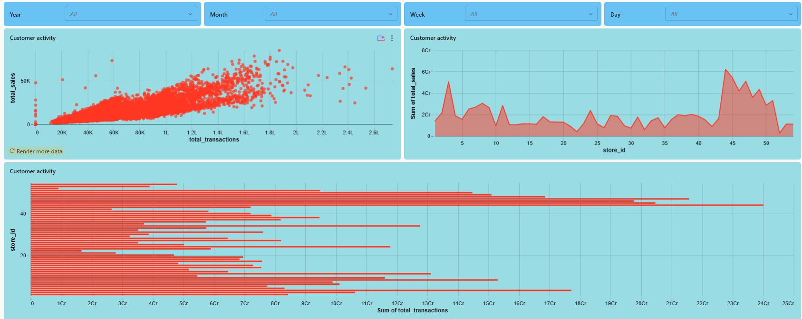

# Grocery Sales ETL Pipeline (Databricks + PySpark)

## Project Overview

This project implements an **end-to-end ETL pipeline for grocery store sales data** using **AWS, Databricks, PySpark, Delta Lake, and DBT**.

The pipeline processes raw retail datasets and transforms them into **analytics-ready datasets** using the **Medallion Architecture (Bronze → Silver → Gold)**.

The final output enables **sales forecasting and retail analytics** by generating aggregated sales features such as:

- Weekly sales trends
- Promotion impact metrics
- Holiday demand patterns
- Store performance insights
- Customer activity insights

---


# Dataset

## Dataset Source

Kaggle – **Store Sales Time Series Forecasting**

The dataset contains historical grocery sales data from **Corporación Favorita**, a large grocery retailer in Ecuador.

### Datasets Used

- `train.csv` → Historical sales data
- `stores.csv` → Store metadata
- `transactions.csv` → Daily store transactions
- `holidays_events.csv` → Holiday information
- `oil.csv` → Oil price data

These datasets simulate a **real-world retail analytics environment**.

---

## Project Architecture

The pipeline integrates **AWS services, Databricks processing, and DBT analytics modeling**.

### End-to-End System Architecture

<p align="center">
  
</p>
---

# Medallion Architecture Layers

## Bronze Layer (Raw Data)

### Purpose

- Store raw data exactly as received
- Preserve data lineage
- Enable traceability of raw ingestion

### Tables

```
raw.sales_transactions
raw.stores
raw.transactions
raw.holidays
raw.oil_prices
```

### Operations

- Raw CSV ingestion from AWS S3
- Schema validation
- Metadata registration via AWS Glue

---

## Silver Layer (Cleaned Data)

### Purpose

- Clean and standardize datasets
- Integrate multiple datasets

### Transformations

- Remove duplicate records
- Convert data types
- Handle missing values
- Join sales data with store metadata
- Join transaction data with sales records
- Extract date features

### Output Table

```
processed.sales_cleaned
```

---

## Gold Layer (Analytics Data)

### Purpose

Generate **business-ready datasets for analytics and forecasting**.

### Features Generated

- Weekly sales aggregation
- Promotion impact metrics
- Holiday sales indicators
- Store performance metrics
- Product category trends
- Customer transaction insights

### Output Table

```
analytics.sales_forecast_features
```

---

# **Air Flow** (Pipeline Orchestration)

The pipeline is orchestrated using **Apache Airflow DAGs**.

### Airflow DAG Tasks

```
Task 1: Bronze Pipeline
Task 2: Silver Pipeline
Task 3: Gold Pipeline
```

### Scheduling

Pipelines run on a **daily schedule** for automated data processing.

---

# Data Quality Checks

Implemented checks include:

- Null value validation
- Duplicate detection
- Schema validation
- Row count checks

Alerts and logs are monitored using:

- Airflow logs
- Databricks logs
- AWS S3 logs

---

# Project Folder Structure

```
grocery-sales-etl
│
├── ingestion
│   └── bronze_ingestion.py
│
├── transformations
│   └── silver_transformation.py
│
├── analytics
│   └── gold_features.py
│
├── utils
│   └── data_validation.py
│
├── configs
│
├── workflows
│   └── main_pipeline.py
│
├── requirements.txt
└── README.md
```

---

# Pipeline Execution Flow

```
bronze_ingestion.py
        ↓
silver_transformation.py
        ↓
gold_features.py
        ↓
main_pipeline.py
```

The `main_pipeline.py` script orchestrates the entire ETL pipeline.

---

# Technologies Used

- Python
- PySpark
- Databricks
- Delta Lake
- AWS S3
- AWS Glue
- Apache Airflow
- DBT
- Git & GitHub

---

# Installation

Clone the repository:

```bash
git clone https://github.com/SuhasSC/grocery-sales-etl-P2_Databricks.git
cd grocery-sales-etl
```

Install dependencies:

```bash
pip install -r requirements.txt
```

---

# Running the Pipeline

Run the ETL pipeline locally:

```bash
python main_pipeline.py
```

Pipeline stages executed:

1. Raw data ingestion (Bronze Layer)
2. Data cleaning and transformation (Silver Layer)
3. Feature engineering and aggregation (Gold Layer)

---

# Analytics Dashboards & Artifacts

This section contains **dashboards generated from the analytics (Gold layer) dataset**.

---

## Store Performance Dashboard

Analyzes store-level performance across different store IDs, cities, and states.



---

## Sales Trends Dashboard

Shows time-based sales patterns including **daily, weekly, and quarterly trends**.



---

## Product Category Analysis Dashboard

Analyzes **sales distribution across product families** to identify high-performing categories.



---

## Promotion Impact Dashboard

Evaluates how **promotions influence total sales performance**.



---

## Holiday Impact Dashboard

Analyzes **holiday events and their effect on sales performance**.



---

## Customer Activity Dashboard

Analyzes **customer transaction activity and its relationship with sales performance**.



---

# Business Insights Generated

The pipeline enables several retail analytics insights.

### Sales Trends

Identify weekly and seasonal demand patterns.

### Store Performance

Determine top-performing stores based on revenue.

### Product Category Analysis

Identify high-demand product families.

### Promotion Effectiveness

Measure sales increase during promotional campaigns.

### Holiday Impact

Analyze how holidays affect product demand.

### Customer Traffic Analysis

Evaluate the relationship between store transactions and sales.

---

# Future Enhancements

- Integrate real-time data ingestion
- Build machine learning forecasting models
- Create advanced BI dashboards
- Implement automated data quality monitoring

---

# License

This project is developed for **educational and research purposes**.

---

# Author

### Project Lead

**Suhas S Chauhan**

### Team Members

- Rahul Garg
- Manoj M D
- Revanth Sai Arcot
- Bhaskar Rao Kodimela

GitHub:

https://github.com/SuhasSC
